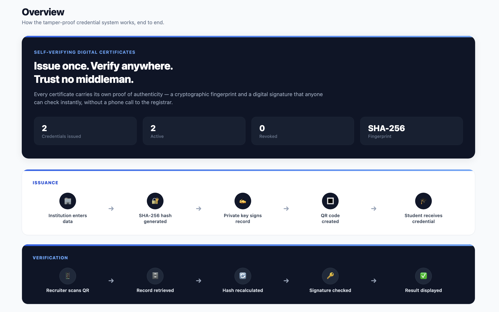
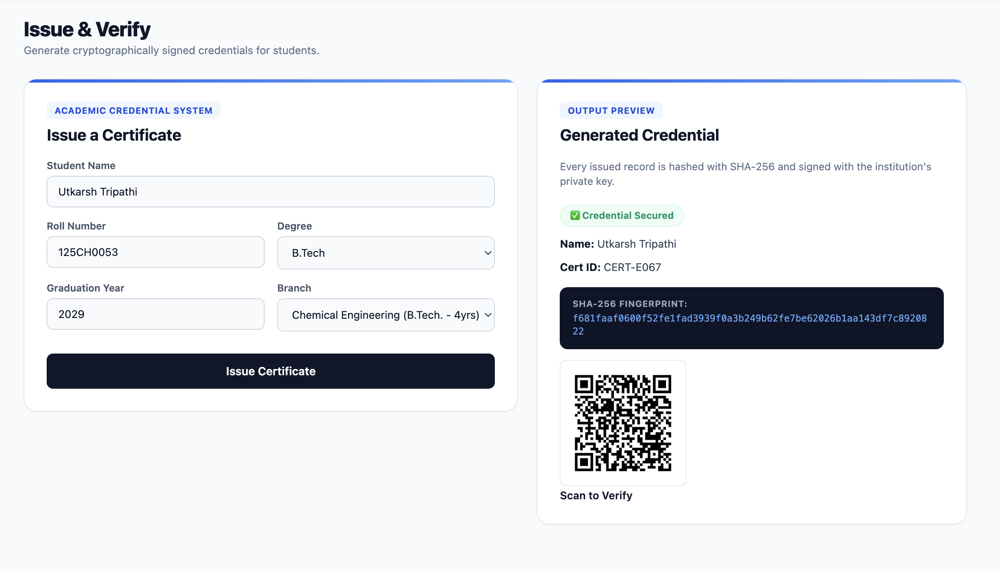
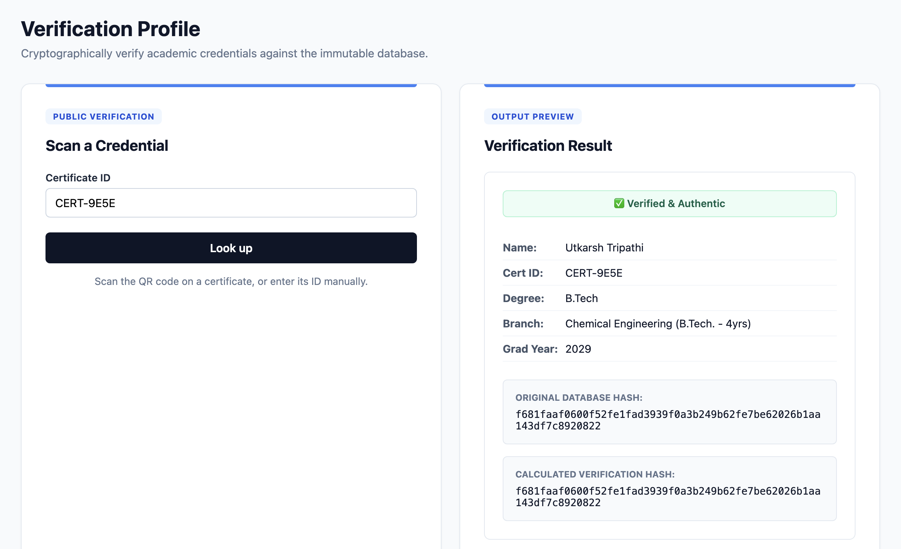
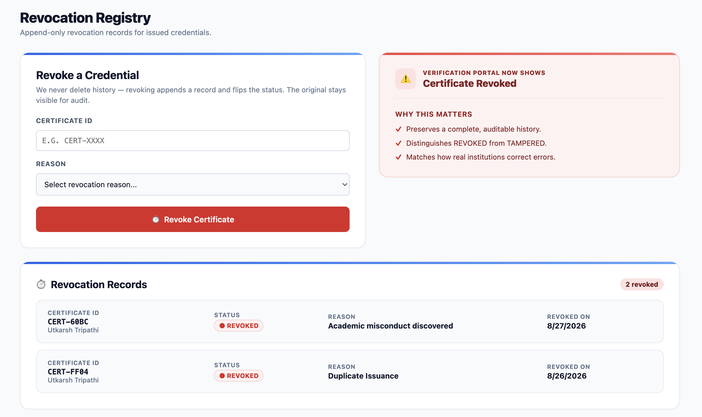

# 🛡️ Abhedya — Tamper-Proof Academic Credential Verification

> **अभेद्य** *(adj.)* — impenetrable; that which cannot be broken through.

**Smart India Hackathon 2026** · **Problem Statement PS-03** · **Theme: Blockchain & Cybersecurity**
**Team GRID 404**

A credential verification system where a degree certificate proves its own authenticity. Any employer, university, or government office can verify a certificate in seconds by scanning a QR code — no account, no login, no phone call to the registrar.

<table>
<tr><td><b>🌐 Live demo</b></td><td><a href="https://eduverse-portal.up.railway.app">eduverse-portal.up.railway.app</a></td></tr>
<tr><td><b>🔐 Institution login</b></td><td><code>/administration_login</code> · password <code>nitr769008</code></td></tr>
<tr><td><b>🔎 Public verification</b></td><td><code>/dashboard/verify</code> — no login required, by design</td></tr>
<tr><td><b>🔑 Institution public key</b></td><td><code>/public-key</code></td></tr>
</table>

---

## Contents

- [The problem](#the-problem)
- [What Abhedya does](#what-abhedya-does)
- [Screenshots](#screenshots)
- [How verification works](#how-verification-works)
- [Try breaking it](#try-breaking-it)
- [Architecture](#architecture)
- [PS-03 requirement coverage](#ps-03-requirement-coverage)
- [Engineering log — problems we hit and how we fixed them](#engineering-log--problems-we-hit-and-how-we-fixed-them)
- [Tech stack](#tech-stack)
- [Running locally](#running-locally)
- [Design decisions and honest scope limits](#design-decisions-and-honest-scope-limits)
- [Roadmap](#roadmap)

---

## The problem

Verifying an academic certificate in India today means emailing or calling the issuing institution and waiting days for a human being to check a physical register. It is slow, it costs the verifier money, and it does not scale — so in practice most employers simply skip it.

The result is a market where forged degrees pass unchecked and genuine graduates are penalised by the delay.

The root cause is simple: **a certificate today is just a document.** It carries no way to prove it hasn't been altered since it was issued, and no way to prove the institution actually issued it.

## What Abhedya does

Abhedya makes every certificate carry its own cryptographic proof.

**At issuance**, the certificate's contents are hashed with SHA-256, that hash is signed with the institution's Ed25519 private key, and the hash is welded into an append-only ledger. A QR code is generated pointing at a public verification URL.

**At verification**, the system recomputes the hash from the stored record and compares it against the hash captured at issuance. If even one character of the student's name, branch, or graduation year has been altered, the two hashes diverge and verification fails immediately.

> **Change one letter, and the proof breaks.** That is the entire idea.

---

## Screenshots

<table>
<tr>
<td width="50%"><b>Institution dashboard</b><br></td>
<td width="50%"><b>Issuing a credential</b><br></td>
</tr>
<tr>
<td width="50%"><b>Public verification portal</b><br></td>
<td width="50%"><b>Revocation registry</b><br></td>
</tr>
</table>

---

## How verification works

A verifier scans the QR code on the certificate and lands on a public page. Four independent checks run:

| # | Check | What it proves | Failure means |
|---|---|---|---|
| 1 | **Hash match** | The record has not been edited since issuance | Data was tampered with |
| 2 | **Ed25519 signature** | This institution issued it — not a forger | Forged or altered credential |
| 3 | **Revocation status** | The institution has not withdrawn it | Degree was revoked |
| 4 | **Ledger chain integrity** | The issuance record itself is intact | Database-level tampering |

A certificate is reported **VALID** only if all four pass.

### One subtle but critical detail

The signature is verified against the **recomputed** hash, not the stored one.

This is easy to get backwards. Verifying against the stored hash would only prove *that the stored hash was signed* — an attacker who edited the student's name in the database would still pass, because the stored hash and its signature would still agree with each other.

By verifying the signature against a hash recomputed live from the actual record, any edit to the underlying data breaks the signature. This is the difference between a system that looks secure and one that is.

### Zero-trust public lookup

The institution's public key is served at **`/public-key`**. A third party can therefore verify any Abhedya signature **completely offline**, using standard cryptographic libraries, without trusting this deployment, this server, or us. Nothing about verification requires our permission.

---

## Try breaking it

This is the fastest way to assess whether the prototype is real. The repo ships with a tamper script that edits a certificate **directly in the database**, simulating a malicious insider who has bypassed the application entirely:

```bash
# 1. Issue a certificate through the dashboard, note its ID
# 2. Verify it — everything green
# 3. Now attack it directly at the database layer:
node tamper.js CERT-XXXXXXXX "Computer Science"
# 4. Re-verify the same certificate
```

**Result:** the recomputed hash no longer matches the stored hash, the Ed25519 signature fails, and the verification page turns red — identifying exactly which field was altered.

No mocking, no hardcoded demo paths. The verification logic queries the live database and recomputes the cryptography on every request.

---

## Architecture

### Hybrid on-chain / off-chain split

PS-03 requires that verification must not expose student personal data. Abhedya splits storage in two:

```
┌─────────────────────────────┐     ┌──────────────────────────────┐
│  certificates  (OFF-CHAIN)  │     │  ledger_blocks  (THE CHAIN)  │
│  ─────────────────────────  │     │  ──────────────────────────  │
│  student_name    ← PII      │     │  cert_id                     │
│  roll_no         ← PII      │────▶│  event_type (ISSUE/REVOKE)   │
│  degree, branch             │     │  data_hash                   │
│  document_hash              │     │  previous_block_hash         │
│  signature                  │     │  block_hash                  │
│                             │     │                              │
│  Never published            │     │  NO PERSONAL DATA AT ALL     │
└─────────────────────────────┘     └──────────────────────────────┘
```

The ledger can therefore be published, audited, replicated, or externally anchored **without leaking a single student's information**. This is the direct answer to PS-03's privacy requirement.

### The hash-chain

Each block is cryptographically linked to its predecessor:

```
block_hash = SHA-256( cert_id | event_type | data_hash | previous_block_hash )
```

The first block chains to a genesis hash of 64 zeroes. Because each block's hash depends on the one before it, altering any historical record invalidates **every block after it**. `verifyChainIntegrity()` walks the entire chain and reports the exact block index at which it breaks.

Both issuance and revocation are written as blocks (`ISSUE` / `REVOKE`), so withdrawing a credential is itself a permanent, tamper-evident event — not a silent status flip.

### Access model

| Route | Access | Rationale |
|---|---|---|
| `/dashboard/*` | Institution only — session-gated, bcrypt | Only the registrar issues or revokes |
| `/dashboard/verify`, `/verify-action` | **Public, unauthenticated** | Deliberate — see below |
| `/public-key` | **Public** | Enables offline third-party verification |

The public routes are unauthenticated **by design**. PS-03 requires verification without middlemen or accounts. Requiring a verifier to register would reintroduce exactly the gatekeeper the system exists to remove.

---

## PS-03 requirement coverage

| Requirement | Status | Where it lives |
|---|---|---|
| Tamper-proof credential storage | ✅ Implemented | SHA-256 + chained `ledger_blocks` |
| Institutional issuance authority | ✅ Implemented | Ed25519 signing, `signing.js` |
| Public verification without middlemen | ✅ Implemented | Unauthenticated `/dashboard/verify` |
| No PII exposed during verification | ✅ Implemented | On-chain / off-chain split |
| Revocation support | ✅ Implemented | `revocations` table + `REVOKE` ledger blocks |
| QR-based instant verification | ✅ Implemented | `qrcode`, embedded in certificate PDFs |
| Offline / third-party verification | ✅ Implemented | `/public-key` endpoint |
| Auditable issuance history | ✅ Implemented | Ledger view + integrity checker |
| Distributed multi-node consensus | ⚠️ Scoped out | See [design decisions](#design-decisions-and-honest-scope-limits) |
| Bulk issuance / bulk verification | ❌ Not implemented | See [roadmap](#roadmap) |

---

## Engineering log — problems we hit and how we fixed them

This section is deliberately honest. Every item below was a real defect found in our own code and fixed.

### 1. Admin login silently failed, and nothing reported an error

**Symptom.** The seeded admin password simply did not work, with no error anywhere.

**Cause.** `setup.js` inserted the admin user with `ON CONFLICT DO NOTHING`. On first run it worked. On every subsequent run — including every password change — Postgres silently discarded the write and returned success. The setup script cheerfully printed ✅ while doing nothing.

**Fix.** Changed to an upsert (`ON CONFLICT ... DO UPDATE SET password_hash = EXCLUDED.password_hash`), so re-running setup genuinely resets the password.

**Lesson.** `DO NOTHING` is not idempotency. It's silent failure wearing idempotency's clothes.

### 2. A missing column that would have killed the demo

**Symptom.** Fresh deployment, first certificate issued, HTTP 500.

**Cause.** `server.js` read and wrote `certificates.doc_type` in four places. `setup.js` never created that column. Our development database had it — added manually by hand — so it worked locally and nowhere else.

**Fix.** Added `doc_type` to the `CREATE TABLE`, plus `ALTER TABLE ... ADD COLUMN IF NOT EXISTS` migrations so existing deployments upgrade without being wiped.

**Lesson.** "Works on my machine" usually means the machine has undocumented state. Schema belongs in version control, not in someone's psql history.

### 3. Certificate IDs would have started colliding

**Symptom.** None yet — which is exactly what made it dangerous.

**Cause.** Certificate IDs used `crypto.randomBytes(2)` — a 65,536-value space. By the birthday bound, a collision becomes likely after roughly 300 certificates, and `cert_id` is the primary key. The failure would have surfaced as a production crash after the system was already trusted.

**Fix.** Widened to 4 random bytes (~4.3 billion values).

**Lesson.** Random ID spaces need the birthday bound, not the total space. √n, not n.

### 4. Revocation left no trace on the "immutable" ledger

**Symptom.** Revoking a certificate worked, but the ledger showed nothing.

**Cause.** Revocation performed a bare `UPDATE certificates SET status='revoked'`. A mutable column flip — no audit row, no ledger entry, no record of who did it or when. Our tamper-evident ledger was blind to the single most security-sensitive action in the system.

**Fix.** Introduced a `revocations` audit table (with `revoked_by` and a foreign key), wrapped the whole operation in a transaction with `SELECT ... FOR UPDATE`, and welded a `REVOKE` block onto the hash-chain. `ledger_blocks` gained an `event_type` column, now part of the block hash.

**Lesson.** An append-only ledger that only records the happy path is not an audit trail.

### 5. Revoking a certificate that didn't exist "succeeded"

**Symptom.** Typing a nonsense certificate ID into the revoke form produced the same success redirect as a real revocation.

**Cause.** `UPDATE ... WHERE cert_id = $1` matching zero rows is not an error in SQL. It returns success with `rowCount: 0`, which the code never checked.

**Fix.** Existence check inside the transaction, with distinct `?error=not_found` and `?error=already_revoked` states surfaced in the UI.

**Lesson.** A registrar who believes they revoked a fraudulent degree, but didn't, is worse off than one who got an error.

### 6. Hashing alone cannot prove who issued a certificate

**Symptom.** Conceptual, not a crash — the more serious kind of bug.

**Cause.** SHA-256 proves data *hasn't changed*. It does not prove *who created it*. Anyone can compute a valid SHA-256 hash of a fake certificate. Our UI promised users a "digital signature" that the backend never actually produced.

**Fix.** Implemented Ed25519 institutional signing end to end — `signing.js`, key generation, a `signature` column, and a public `/public-key` endpoint for offline third-party verification. Signing degrades gracefully: with no keys configured, certificates issue unsigned and are reported as such rather than crashing.

**Lesson.** Integrity and authenticity are different properties. Hashing gives you the first. Only signing gives you the second.

### 7. Signature verification that would have looked correct and been useless

**Cause.** The obvious implementation verifies the signature against the hash stored in the database. That proves only that the stored hash was signed — an attacker editing the student's name would still pass, since the stored hash and its signature remain mutually consistent.

**Fix.** The signature is verified against a hash **recomputed live** from the actual record. Any edit to the underlying data now breaks the signature.

**Lesson.** This is the difference between cryptography and cryptography-shaped code. Both compile.

### 8. Session secret with a silent insecure fallback

**Cause.** `secret: process.env.SESSION_SECRET || "fallback_secret"`. Any deployment that forgot the environment variable shared a publicly-known session key — forgeable admin sessions, no warning.

**Fix.** The server now refuses to start in production without `SESSION_SECRET`, and warns loudly in development. Also set `cookie.secure` from `NODE_ENV` and enabled `trust proxy` — without it, Railway's TLS termination makes Express think the connection is plain HTTP and suppress the secure cookie entirely.

**Lesson.** A fallback that makes an insecure configuration boot successfully is worse than a crash.

### 9. A hardcoded deployment URL in the QR generator

**Cause.** The verification URL baked into every QR code was a string literal. Changing the deployment domain would have silently invalidated every certificate already printed and distributed.

**Fix.** Extracted to a single `APP_BASE_URL` environment variable with one helper function.

### 10. Smaller fixes

- Two dead **Logout** buttons (`overview.ejs`, `ledger.ejs`) rendered as `<button>` with no handler — clicking did nothing. Wired to `/logout`.
- A public `/test-hash` debug route left over from early development. Removed.
- No 404 or error handler — unmatched routes leaked Express's default stack-trace page. Added both.
- `.DS_Store` files committed to the repo. Removed and gitignored.

---

## Tech stack

| Layer | Choice | Why |
|---|---|---|
| Runtime | Node.js + Express 5 | Fast iteration; `node:crypto` is built in |
| Views | Server-rendered EJS | Auto-escaping by default; no client-side trust |
| Database | PostgreSQL (Railway) | Transactions and foreign keys for the audit trail |
| Hashing | SHA-256 (`node:crypto`) | Standard, no third-party crypto dependency |
| Signing | Ed25519 (`node:crypto`) | Small keys, fast verification, no parameter footguns |
| Auth | `express-session` + bcrypt | Cost-factor hashing, server-side sessions |
| QR / PDF | `qrcode`, `pdfkit` | Real generation, not images |

**No third-party cryptography libraries.** Everything security-critical uses Node's audited built-in `crypto` module.

---

## Running locally

```bash
npm install
cp .env.example .env      # then fill in DATABASE_URL and SESSION_SECRET
npm run generate-keys     # creates the institution's Ed25519 keypair
npm run setup             # creates all four tables and seeds the admin
npm run dev
```

Open <http://localhost:3000>. Requires a PostgreSQL database — a free Railway Postgres instance works.

Generate a session secret with:

```bash
node -e "console.log(require('crypto').randomBytes(32).toString('hex'))"
```

`npm run setup` is safe to re-run against an existing database — every statement is `IF NOT EXISTS` or `ADD COLUMN IF NOT EXISTS`.

`keys/private.pem` is gitignored and never committed. For production, generate the keypair locally and paste the PEM contents into the `PRIVATE_KEY` / `PUBLIC_KEY` environment variables.

### Project structure

```
├── server.js              # Routes, hashing, ledger, verification
├── signing.js             # Ed25519 signing and verification
├── setup.js               # Schema creation and migrations
├── tamper.js              # Attack simulator for the tamper demo
├── keys/generate-keys.js  # Keypair generation
├── views/                 # EJS templates
└── public/                # CSS, images
```

---

## Design decisions and honest scope limits

### On the word "blockchain"

Abhedya implements a **cryptographic hash-chain with institutional signing**, not a distributed consensus network. Every block is chained and tamper-evident, but the chain lives in a single institutional database rather than being replicated across mutually distrusting nodes.

This is a deliberate scoping decision, not an oversight. A credential registry has exactly one authoritative issuer — the university. The trust problem it genuinely needs to solve is **tamper-evidence and authenticity**, not **consensus between parties who distrust each other**. Signing is what makes forgery infeasible; chaining is what makes silent edits detectable. Adding proof-of-work or a validator set would add cost and latency without adding a security property this problem actually needs.

### Known limitation

A privileged insider holding **both** database access **and** the institution's private key could rewrite the chain consistently, and integrity checking would still report valid.

Ed25519 signing raises the bar substantially — database access alone is no longer sufficient, which was true of an earlier version of this system — but it does not eliminate the risk. Closing it fully requires anchoring the chain head to an external, independent source of truth: a public blockchain commitment or an OpenTimestamps proof. That is the highest-priority item on our roadmap, and we would rather state the gap plainly than claim a property we do not have.

### Also not implemented

- CSRF protection on state-changing POST routes
- Bulk issuance and bulk verification
- Multi-institution federation

---

## Roadmap

| Priority | Item | Why |
|---|---|---|
| 🔴 High | External anchoring (OpenTimestamps / public chain) | Closes the insider-rewrite gap above |
| 🔴 High | CSRF tokens on state-changing routes | Standard hardening |
| 🟡 Medium | Bulk issuance and verification (CSV) | Real registrars work in batches |
| 🟡 Medium | Hardware-backed key storage (HSM / KMS) | Private key currently lives on disk |
| 🟢 Low | Multi-institution federation | One verification portal, many issuers |

---

## Team GRID 404

Built for **Smart India Hackathon 2026**, Problem Statement **PS-03 — Blockchain-Based Tamper-Proof Academic Credential Verification System**.

AUTHOR:
1) Utkarsh Tripathi
2) Pratik Choudhury
3) Suryansh Das
4) Yaara Aafrin
5) Ekta Mohanty
6) Swayam Sohani
